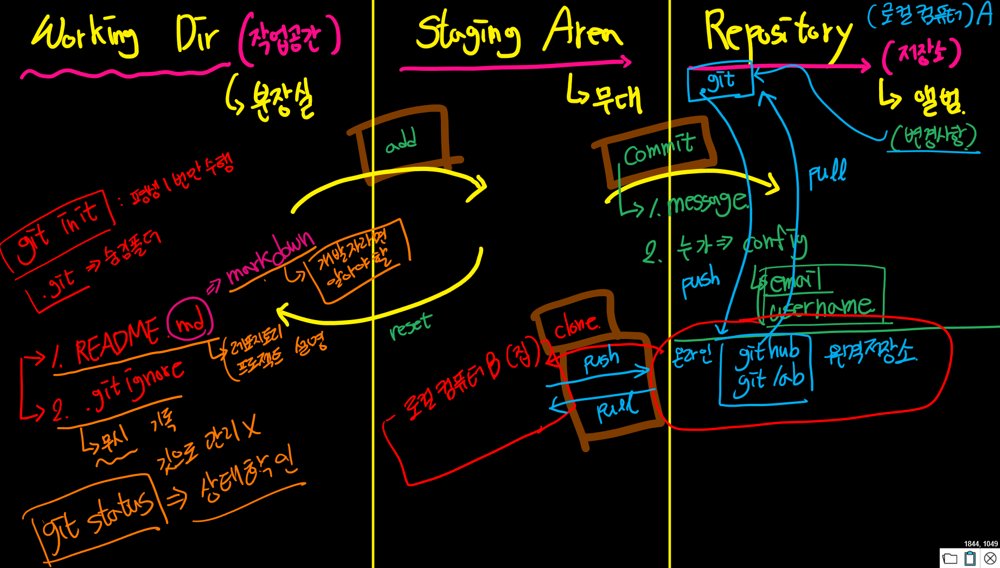

2023.07.12  
<스타트 캠프 1일차>  
​  
git : 분산 버전 관리 프로그램  
​  
우리는 모두 버전 관리를 경험했다.  
ex) 레포트 작성 시  
보고서_230712  
보고서_230713  
...  
​  
만약 버전이 너무 많아지면 어떻게 관리해?  보고서가 1000장이 넘어가면? 변경 사항을 따로 관리하자. -> 이것이 git의 역할  
​   
GIT은 코드의 히스토리를 기록해주는 도구다.  
​  
github, gitlab은 git에 있는 변경 사항을 올리는 사이트.  
​  
​  
대기업에서는 안전성을 위해 프로그램 버전 업을 하지 않는다. 예전 버전 선호.  
최신 버전을 쓰고 싶으면 스타트업을 가자. 근디 거긴 바로 실전이라서 능력이 좋아야 함.  
​   
오른쪽 클릭 -> open git bash here -> 리눅스 환경에서 개발 가능  
​  
Working Dir(작업공간)　　/　　Staging Area(기록 전 작업물을 올려놓는 공간)　　　/　　　Repository(저장소)  
분장실　　　　　　　　　/　　무대　　　　　　　　　　　　　　　　　　　　　/　　　앨범  
　　　　　　　　　　　　　　　　　　　　　　　　　　　　　　　　　　　　　　　　　변경사항들이 기록되는 공간  
　　　　　　　　　　　　　　　　　　　　　　　　　　　　　　　　->commit 1. message 2. 누가? => config email,username 
　　　　　　　　　　　->add  
　　　　　　　　　　　<-reset  
　　　　　　　　　　　　　　　　　　　　　　　　　　　　　　　　　　　　　　.git(변경사항)            로컬컴퓨터 A  
　　　　　　　　　　　　　　　　　　　　　　　　　　　　　　　　　　　____________________________________________________ 
　　　　　　　　　　　　　　　　　　　　　　　　　　　　　　　　　　　　　　↓push       ↑pull   
                    
　　　　　　　　　　　　　　　　　　　　　　　　　　　　　　　　　　　　　　/  온라인 github, gitlab    원격저장소  
　　　　　　　　　　　　　　　　　　　　　　　　　　　　　　　　　　　　　　　↓clone(최초) 그후로는 ↓push  ↑pull​  
　　　　　　　　　　　　　　　　　　　　　　　　　　　　　　　　　　　　　　로컬컴퓨터 B(집)  
​  
잔디심기는 email, username이 본인과 일치해야 자신의 잔디를 심을 수 있다  
​  
git init : 평생 1번만 수행  
.git : 숨김폴더  
​  
1. README.md => md는 markdown을 의미, 레포지토리와 프로젝트 설명을 적음  
2. .git ignore => 무시, 개인의 비밀키라던지 인터넷에 올리면 안되는 건 이 파일에 작성, 그러면 깃으로 관리하지 않음  
3. git status => 상태 확인  
​  
markdown은 개발자라면 알아야 할 작성법  
​  
CLI     /   GUI  
cmd창  /  해당 경로 폴더  
​  
ctrl + l : 창 깨끗하게  
​  
git add + 1. 파일명 2. 폴더명 3. .(전부)  
​  
git status 해서 빨간 글씨 의미 => working dir에 있다  
​  
.gitignore 사이트 > 프로그래밍 언어별로 추천해줌 그대로 복붙  
https://www.toptal.com/developers/gitignore/

